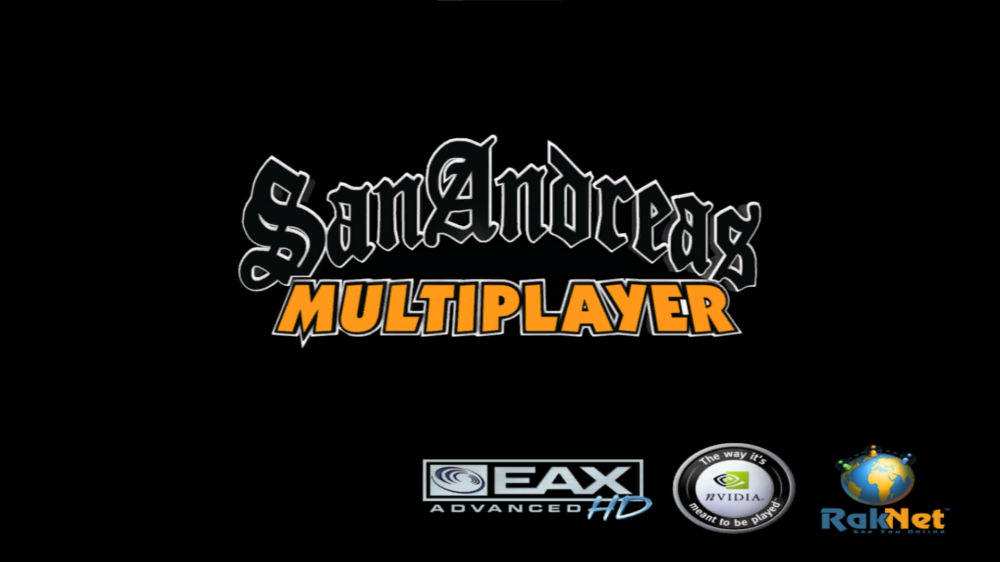

# samp-custom-loading-screen

lightweight C++20 plugin for San Diarreas Multiplayer **(SA:MP)** that replaces the default loading screen with a custom image.

## build
```bash
cmake -S . -B build -A Win32
```

```bash
cmake --build build --config Release
```

## installation

> [!WARNING]
> Image resolution or size might be affected if `widescreen.asi` is installed.

1.  copy the generated `custom-loading-screen.asi` and `loadscs_config.cfg` (from `build/Release/`) to your gta san andreas root directory.

2. make sure you have **silent's asi loader** installed.
## usage
**1. URL**

In `loadscs_config.cfg`, set the `IMAGE_URL` to a direct link of a PNG or JPG image.
```ini
IMAGE_URL=https://wallpapercave.com/wp/wp5334251.jpg
```

**2. LOCAL IMAGE**

If you leave `IMAGE_URL` empty or remove the line, the plugin falls back to loading a local file manually
1.  Clear config: `IMAGE_URL=`
2.  Place your image at: `GTA San Andreas/loadscs/loading_screen.png` **(supports gif)**

## screenshots

**without plugin**



**with plugin**


